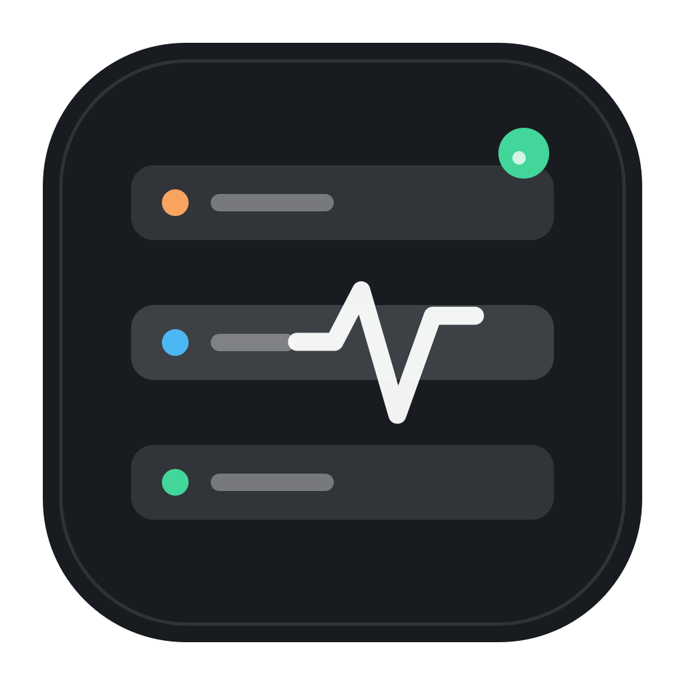

<p align="center">
  
</p>

<h1 align="center">Sub2API Monitor</h1>

<p align="center">原生 macOS 菜单栏监控客户端，面向自托管 <a href="https://github.com/Wei-Shaw/sub2api">Sub2API</a> 实例。</p>

## 功能

- 菜单栏实时显示余额、今日消费、RPM 或账户健康
- 查看今日请求、Token、RPM/TPM、平均延迟
- 管理员可查看用户活跃度与上游账户异常、限流、过载状态
- 支持账户登录和低权限 API Key；API Key 是稳定的 Token 连接方式
- 支持 TOTP 两步验证与 refresh token 自动轮转
- 凭据存入 macOS Keychain，密码永不落盘
- 可配置 1、5、15 或 30 分钟刷新频率和登录时启动
- 菜单关闭时自动将后台轮询降至至少 5 分钟，唤醒或展开菜单时立即刷新
- 支持反向代理子路径，例如 `https://example.com/sub2api`

## 系统要求

- macOS 14 Sonoma 或更高版本
- 建议 Sub2API `v0.1.183` 或更高版本
- Xcode 16+ 或对应 Swift 6 工具链（仅从源码构建时需要）

## 构建

```bash
git clone https://github.com/jihtsan/sub2api-console.git
cd sub2api-console
make test
make app
open "dist/Sub2API Monitor.app"
```

生成的应用位于 `dist/Sub2API Monitor.app`，使用本机 ad-hoc 签名。可将其移动到 `/Applications`。

开发时也可以直接运行：

```bash
swift run Sub2APIConsole
```

## 连接方式

| 方式 | 凭据 | 可见数据 | 会话续期 |
| --- | --- | --- | --- |
| 账户 | 邮箱、密码，可选 TOTP | 用户 Dashboard；管理员可见系统指标 | 自动 |
| API Key | Sub2API API Key | 当前 Key 的余额、额度和用量 | Key 有效期内持续可用 |

服务器地址可以填写站点根地址或 `/api/v1` 地址，客户端会自动规范化。API Key 是推荐的 Token 模式；启用了登录 CAPTCHA 的实例无法直接完成原生账户登录，请使用 API Key。

## 使用的接口

- `POST /api/v1/auth/login`
- `POST /api/v1/auth/login/2fa`
- `POST /api/v1/auth/refresh`
- `GET /api/v1/auth/me`
- `GET /api/v1/usage/dashboard/stats`
- `GET /api/v1/admin/dashboard/stats`（仅管理员）
- `GET /v1/usage`（API Key 模式）

接口调研和版本注意事项见 [docs/sub2api-api-research.md](docs/sub2api-api-research.md)。

## 安全

- Access Token、Refresh Token 和 API Key 只存储在 macOS Keychain。
- 账户密码仅用于当次登录请求，不写入磁盘。
- 除本机开发环境外，请始终使用 HTTPS。
- 客户端不会记录或上传凭据，也不包含第三方分析 SDK。

漏洞报告方式见 [SECURITY.md](SECURITY.md)。

## 开发

```bash
swift build
swift test
./scripts/build-app.sh
```

项目不依赖第三方 Swift Package。`Sub2APIKit` 封装 API、数据模型与 Keychain，`Sub2APIConsole` 提供 SwiftUI 菜单栏界面。

## 许可证

[MIT](LICENSE)。本项目是独立社区客户端，与 Sub2API 官方项目及其维护者无隶属关系。
